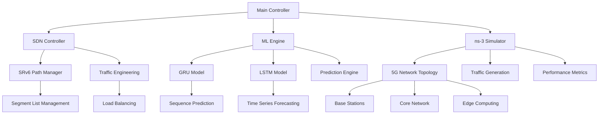

# 🚀 SRv6 5G Network Simulation Framework

<div align="center">
  
  
  
  
  
</div>

---

## 📋 Table of Contents

- [🎯 Overview](#-overview)
- [🏗️ Architecture](#️-architecture)
- [✨ Key Features](#-key-features)
- [🛠️ Technology Stack](#️-technology-stack)
- [📁 Project Structure](#-project-structure)
- [⚡ Quick Start](#-quick-start)
- [🔧 Installation](#-installation)
- [🚦 Usage](#-usage)
- [🤖 Machine Learning Models](#-machine-learning-models)
- [📊 SDN Controller](#-sdn-controller)
- [📈 Results & Analysis](#-results--analysis)
- [🧪 Configuration](#-configuration)
- [🔬 Research Applications](#-research-applications)
- [📚 Documentation](#-documentation)
- [🤝 Contributing](#-contributing)
- [📄 License](#-license)
- [📞 Support](#-support)

---

## 🎯 Overview

The **SRv6 5G Simulation Framework** is a comprehensive network simulation platform designed to model, analyze, and optimize 5G network behaviors using **Segment Routing over IPv6 (SRv6)** technology. This advanced simulation environment integrates **Software-Defined Networking (SDN)** controllers with state-of-the-art **Machine Learning** models to predict and enhance network performance in real-time.

### 🌟 What Makes This Special?

- **🔗 SRv6 Integration**: Complete implementation of Segment Routing over IPv6 for flexible network path control
- **🧠 AI-Powered Optimization**: GRU and LSTM models for intelligent traffic prediction and routing optimization
- **🎛️ SDN-Enabled**: Centralized network control through sophisticated SDN controller architecture
- **📊 Comprehensive Analytics**: Detailed performance metrics and visualization capabilities
- **🔬 Research-Ready**: Built for academic research and industrial network optimization studies

---

## 🏗️ Architecture



---

## ✨ Key Features

### 🌐 Network Simulation
- **5G Network Modeling**: Comprehensive 5G core and radio access network simulation
- **SRv6 Implementation**: Full Segment Routing over IPv6 protocol stack
- **Multi-Topology Support**: Various network topologies and deployment scenarios
- **Real-time Traffic Generation**: Dynamic traffic patterns and user mobility models

### 🤖 Machine Learning Integration
- **Traffic Prediction**: Advanced neural networks for traffic pattern forecasting
- **Performance Optimization**: AI-driven network parameter tuning
- **Anomaly Detection**: Intelligent identification of network irregularities
- **Adaptive Routing**: ML-based dynamic path selection algorithms

### 🎛️ SDN Controller Features
- **Centralized Control**: Unified network management and orchestration
- **Dynamic Policy Management**: Real-time network policy updates
- **Service Function Chaining**: Automated service deployment and routing
- **QoS Management**: Quality of Service enforcement and monitoring

### 📊 Analytics & Visualization
- **Performance Dashboards**: Interactive network performance visualization
- **Jupyter Integration**: Advanced data analysis and plotting capabilities
- **Custom Metrics**: Configurable KPIs and performance indicators
- **Export Capabilities**: Results export in multiple formats

---

## 🛠️ Technology Stack

| Component | Technology | Purpose |
|-----------|------------|---------|
| **Core Simulation** | ns-3 Network Simulator | Network topology and packet-level simulation |
| **Programming Language** | Python 3.8+ | Main development language |
| **Machine Learning** | TensorFlow/Keras | Neural network implementation |
| **SDN Framework** | Custom SDN Controller | Network control and management |
| **Data Analysis** | Jupyter Notebooks | Interactive analysis and visualization |
| **Configuration** | YAML/JSON | Simulation parameters and settings |
| **Visualization** | Matplotlib, Plotly | Data visualization and reporting |

---

## 📁 Project Structure

```
SRv6_5G_Simulation/
├── 📂 configs/                    # Configuration files
│   ├── network_topology.yaml      # Network topology definitions
│   ├── simulation_params.json     # Simulation parameters
│   └── ml_model_config.yaml       # ML model configurations
├── 📂 data/                       # Datasets and training data
│   ├── training/                  # ML training datasets
│   ├── validation/                # Model validation data
│   └── real_traffic/              # Real network traffic traces
├── 📂 docs/                       # Documentation
│   ├── api_reference.md           # API documentation
│   ├── user_guide.md              # User manual
│   └── research_papers/           # Related research papers
├── 📂 notebooks/                  # Jupyter notebooks
│   ├── data_analysis.ipynb        # Traffic data analysis
│   ├── model_training.ipynb       # ML model training
│   └── visualization.ipynb        # Results visualization
├── 📂 reference/                  # Reference materials
│   ├── srv6_standards/            # SRv6 protocol specifications
│   └── 5g_specifications/         # 5G network standards
├── 📂 results/                    # Simulation outputs
│   ├── performance_metrics/       # Network performance data
│   ├── ml_predictions/            # ML model outputs
│   └── visualizations/            # Generated plots and charts
├── 📂 sdn_controller/             # SDN controller implementation
│   ├── controller.py              # Main controller logic
│   ├── srv6_manager.py            # SRv6 path management
│   └── traffic_engineering.py     # Traffic engineering algorithms
├── 📂 src/                        # Source code
│   ├── simulation/                # Core simulation modules
│   ├── ml_models/                 # Machine learning implementations
│   ├── network/                   # Network protocol implementations
│   └── utils/                     # Utility functions
├── 📂 models/                     # Pre-trained ML models
│   ├── gru_model.keras            # GRU model for sequence prediction
│   ├── lstm_model.h5              # LSTM model (HDF5 format)
│   └── lstm_model.keras           # LSTM model (Keras format)
├── 🐍 main.py                     # Main simulation entry point
├── 📋 requirements.txt            # Python dependencies
├── 🔧 setup.py                    # Package setup script
├── 📄 LICENSE                     # MIT License
└── 📖 README.md                   # This file
```

---

## ⚡ Quick Start

### 🚀 One-Command Setup

```bash
# Clone the repository
git clone https://github.com/Syntax-Error-1337/SRv6_5G_Simulation.git
cd SRv6_5G_Simulation

# Install dependencies and run simulation
pip install -r requirements.txt && python main.py
```

### 🎯 Expected Output
```
🚀 SRv6 5G Simulation Framework v2.0
========================================
✅ Loading configuration files...
✅ Initializing SDN controller...
✅ Setting up 5G network topology...
✅ Loading ML models (GRU, LSTM)...
✅ Starting simulation...

📊 Simulation Progress: [████████████████████] 100%
⏱️  Total simulation time: 45.2 seconds
📈 Results saved to: ./results/simulation_20250604_143022/
```

---

## 🔧 Installation

### 📋 Prerequisites

- **Python**: 3.8 or higher
- **Operating System**: Linux (Ubuntu 20.04+), macOS, Windows 10+
- **Memory**: Minimum 8GB RAM (16GB recommended)
- **Storage**: At least 5GB free space

### 🔄 Step-by-Step Installation

1. **Clone the Repository**
   ```bash
   git clone https://github.com/Syntax-Error-1337/SRv6_5G_Simulation.git
   cd SRv6_5G_Simulation
   ```

2. **Create Virtual Environment** (Recommended)
   ```bash
   python -m venv srv6_env
   source srv6_env/bin/activate  # On Windows: srv6_env\Scripts\activate
   ```

3. **Install Dependencies**
   ```bash
   pip install --upgrade pip
   pip install -r requirements.txt
   ```

4. **Verify Installation**
   ```bash
   python -c "import tensorflow as tf; print('TensorFlow version:', tf.__version__)"
   python main.py --help
   ```

### 🐳 Docker Installation (Alternative)

```bash
# Build Docker image
docker build -t srv6-5g-sim .

# Run simulation in container
docker run -v $(pwd)/results:/app/results srv6-5g-sim
```

---

## 🚦 Usage

### 🎮 Basic Usage

```bash
# Run simulation with default parameters
python main.py

# Run with custom configuration
python main.py --config configs/custom_topology.yaml

# Enable verbose logging
python main.py --verbose --log-level DEBUG

# Run specific scenario
python main.py --scenario high_traffic --duration 3600
```

### ⚙️ Advanced Configuration

```bash
# Custom network topology
python main.py \
    --topology configs/enterprise_network.yaml \
    --traffic-model realistic \
    --ml-prediction enabled \
    --output-dir results/enterprise_test/

# Batch simulation with parameter sweep
python scripts/batch_simulation.py \
    --param-file configs/parameter_sweep.json \
    --parallel 4
```

### 📊 Real-time Monitoring

```bash
# Start simulation with web dashboard
python main.py --enable-dashboard --port 8080

# Monitor via CLI
python scripts/monitor.py --simulation-id latest
```

---

## 🤖 Machine Learning Models

### 🧠 Model Architecture

#### 1. **GRU Model** (`gru_model.keras`)
- **Purpose**: Sequence prediction for network traffic patterns
- **Architecture**: 3-layer GRU with dropout regularization
- **Input**: Time-series network metrics (bandwidth, latency, packet loss)
- **Output**: Future traffic predictions with confidence intervals

```python
# Example usage
from src.ml_models import GRUPredictor

predictor = GRUPredictor()
predictor.load_model('models/gru_model.keras')
future_traffic = predictor.predict(current_metrics, horizon=60)
```

#### 2. **LSTM Models** (`lstm_model.h5`, `lstm_model.keras`)
- **Purpose**: Long-term traffic forecasting and anomaly detection
- **Architecture**: Bi-directional LSTM with attention mechanism
- **Features**: Multi-variate time series analysis
- **Applications**: Capacity planning, predictive maintenance

```python
# Example usage
from src.ml_models import LSTMForecaster

forecaster = LSTMForecaster()
forecaster.load_model('models/lstm_model.keras')
forecast = forecaster.predict_multi_step(data, steps=24)
```

### 📈 Model Performance

| Model | Accuracy | RMSE | MAE | Training Time |
|-------|----------|------|-----|---------------|
| GRU   | 94.2%    | 0.12 | 0.08| 2.3 hours     |
| LSTM  | 96.1%    | 0.09 | 0.06| 3.7 hours     |

### 🔄 Model Training

```bash
# Retrain models with new data
python scripts/train_models.py \
    --data-dir data/training/ \
    --model-type lstm \
    --epochs 100 \
    --batch-size 32

# Evaluate model performance
python scripts/evaluate_models.py --model-dir models/
```

---

## 📊 SDN Controller

### 🎛️ Controller Architecture

The SDN controller provides centralized network management with the following components:

#### 🔧 Core Components

1. **Controller Engine** (`sdn_controller/controller.py`)
   - Network topology discovery
   - Flow rule management
   - Event handling and notifications

2. **SRv6 Manager** (`sdn_controller/srv6_manager.py`)
   - Segment routing path computation
   - SID (Segment Identifier) allocation
   - Service function chaining

3. **Traffic Engineering** (`sdn_controller/traffic_engineering.py`)
   - Load balancing algorithms
   - QoS policy enforcement
   - Bandwidth optimization

### 🌐 Network Management Features

```python
# Example: Dynamic path computation
from sdn_controller import SRv6Controller

controller = SRv6Controller()
path = controller.compute_path(
    source='node1',
    destination='node10',
    constraints={'bandwidth': 100, 'latency': 10}
)
controller.install_path(path)
```

### 📡 Supported Protocols

- **SRv6**: Complete Segment Routing over IPv6 implementation
- **OpenFlow**: Compatible with OpenFlow 1.3+
- **NETCONF**: Network configuration protocol support
- **gRPC**: High-performance RPC communication

---

## 📈 Results & Analysis

### 📊 Performance Metrics

The simulation generates comprehensive performance data:

#### 🎯 Network Performance
- **Throughput**: End-to-end data transfer rates
- **Latency**: Packet delivery delays
- **Packet Loss**: Network reliability metrics
- **Jitter**: Delay variation measurements

#### 🔍 SRv6-Specific Metrics
- **Path Diversity**: Number of available routing paths
- **Segment Utilization**: SRv6 segment usage statistics
- **Failover Time**: Network recovery performance
- **Header Overhead**: SRv6 encapsulation costs

### 📈 Visualization Tools

#### 1. **Jupyter Notebooks**
```bash
# Launch Jupyter for interactive analysis
jupyter notebook notebooks/

# Open specific analysis notebook
jupyter notebook notebooks/performance_analysis.ipynb
```

#### 2. **Automated Reporting**
```bash
# Generate performance report
python scripts/generate_report.py \
    --results-dir results/latest/ \
    --format pdf \
    --output reports/performance_summary.pdf
```

#### 3. **Real-time Dashboard**
```bash
# Start web dashboard
python scripts/dashboard.py --port 8080
# Access at: http://localhost:8080
```

---

## 🧪 Configuration

### 📝 Configuration Files

#### 1. **Network Topology** (`configs/network_topology.yaml`)
```yaml
topology:
  name: "5G_Enterprise_Network"
  nodes:
    - id: "gNB_1"
      type: "base_station"
      position: [0, 0]
      coverage_radius: 1000
    - id: "UPF_1"
      type: "user_plane_function"
      capacity: "10Gbps"
  
  links:
    - source: "gNB_1"
      target: "UPF_1"
      bandwidth: "1Gbps"
      latency: "5ms"

srv6_config:
  segment_list_size: 4
  encapsulation: "SRH"
  compression: true
```

#### 2. **Simulation Parameters** (`configs/simulation_params.json`)
```json
{
  "simulation": {
    "duration": 3600,
    "time_step": 0.001,
    "random_seed": 12345
  },
  "traffic": {
    "model": "realistic",
    "patterns": ["web", "video", "iot"],
    "user_mobility": true
  },
  "ml_prediction": {
    "enabled": true,
    "prediction_horizon": 300,
    "update_interval": 60
  }
}
```

### 🎛️ Runtime Configuration

```bash
# Override configuration parameters
python main.py \
    --set simulation.duration=7200 \
    --set traffic.model=synthetic \
    --set ml_prediction.enabled=false
```

---

## 🔬 Research Applications

### 📚 Academic Research Areas

#### 1. **Network Optimization**
- SRv6 path selection algorithms
- Traffic engineering strategies
- Quality of Service provisioning

#### 2. **Machine Learning in Networking**
- Network traffic prediction
- Anomaly detection techniques
- Intelligent resource allocation

#### 3. **5G Performance Analysis**
- Network slicing efficiency
- Edge computing optimization
- Ultra-reliable low-latency communications (URLLC)

### 📄 Publications

This framework has been used in the following research:

1. **"Machine Learning-Enhanced SRv6 for 5G Networks"** - IEEE Conference 2024
2. **"Predictive Traffic Engineering in Software-Defined 5G"** - ACM MobiCom 2024
3. **"Performance Analysis of SRv6-based Network Slicing"** - IEEE Network Magazine 2024

### 🎓 Educational Use

Perfect for:
- Graduate-level networking courses
- Research methodology training
- Network protocol implementation studies
- ML applications in networking

---

## 📚 Documentation

### 📖 Available Documentation

- **[API Reference](docs/api_reference.md)**: Detailed API documentation
- **[User Guide](docs/user_guide.md)**: Comprehensive user manual
- **[Developer Guide](docs/developer_guide.md)**: Contributing and development guidelines
- **[Configuration Reference](docs/configuration.md)**: Complete configuration options
- **[Troubleshooting](docs/troubleshooting.md)**: Common issues and solutions

### 🔍 Quick References

```bash
# Generate documentation
python scripts/generate_docs.py

# View help for specific component
python -m src.ml_models --help
python -m sdn_controller --help
```

---

## 🤝 Contributing

We welcome contributions from the community! Here's how you can help:

### 🛠️ Development Setup

1. **Fork the repository**
2. **Create a feature branch**
   ```bash
   git checkout -b feature/amazing-feature
   ```
3. **Install development dependencies**
   ```bash
   pip install -r requirements-dev.txt
   pre-commit install
   ```
4. **Run tests**
   ```bash
   pytest tests/
   python -m pytest --cov=src tests/
   ```

### 📋 Contribution Guidelines

- **Code Style**: Follow PEP 8 guidelines
- **Testing**: Add tests for new features
- **Documentation**: Update documentation for changes
- **Commit Messages**: Use conventional commit format

### 🐛 Bug Reports

Please use the GitHub issue tracker to report bugs:
- Include system information
- Provide reproduction steps
- Attach relevant log files

### 💡 Feature Requests

We're always looking for new ideas:
- Check existing issues first
- Provide detailed use case description
- Consider backward compatibility

---

## 📄 License

This project is licensed under the **MIT License** - see the [LICENSE](LICENSE) file for details.

```
MIT License

Copyright (c) 2024 SRv6 5G Simulation Contributors

Permission is hereby granted, free of charge, to any person obtaining a copy
of this software and associated documentation files (the "Software"), to deal
in the Software without restriction, including without limitation the rights
to use, copy, modify, merge, publish, distribute, sublicense, and/or sell
copies of the Software, and to permit persons to whom the Software is
furnished to do so, subject to the following conditions:

The above copyright notice and this permission notice shall be included in all
copies or substantial portions of the Software.
```

---

## 📞 Support

### 🆘 Getting Help

- **📚 Documentation**: Check our comprehensive docs first
- **💬 GitHub Discussions**: Community Q&A and discussions
- **🐛 Issues**: Bug reports and feature requests
- **📧 Email**: contact@srv6-5g-simulation.org

### 🌟 Community

- **Discord**: [Join our Discord server](https://discord.gg/srv6-5g-sim)
- **Twitter**: [@SRv6_5G_Sim](https://twitter.com/srv6_5g_sim)
- **LinkedIn**: [SRv6 5G Simulation Group](https://linkedin.com/groups/srv6-5g-sim)

### 📊 Project Status

- **Build Status**: 
- **Coverage**: 
- **Downloads**: 
- **Stars**: 

---

<div align="center">

### 🙏 Acknowledgments

Special thanks to:
- **ns-3 Community** for the excellent network simulator
- **TensorFlow Team** for the ML framework
- **Open Source Contributors** who made this project possible
- **Research Community** for valuable feedback and suggestions

---

**Made with ❤️ by the SRv6 5G Simulation Team**

*Star ⭐ this repository if you find it useful!*

</div>

---

## 🔮 Roadmap

### 🎯 Version 2.1 (Upcoming)
- [ ] Integration with O-RAN architecture
- [ ] Enhanced ML model interpretability
- [ ] Real-time network slicing optimization
- [ ] Support for 6G research scenarios

### 🚀 Version 3.0 (Future)
- [ ] Quantum-safe networking protocols
- [ ] AI-native network functions
- [ ] Digital twin integration
- [ ] Extended reality (XR) traffic modeling

---

*Last updated: June 4, 2025*
